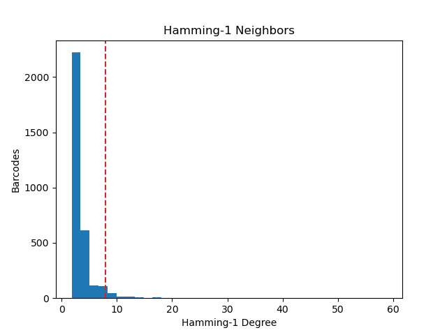

# barcode_seq

Program for determining hamming-1 neighbors and degree of MapSeq reads.

This takes as an input a FASTQ (gzipped or un) which contains MapSeq reads and produces an output with the whitelisted barcodes written out to a new line.

Number of barcodes written out is determined by the degree associated with the n-nth most-connected (by hamming-1 degree) barcode where n is the number of cells sequenced  

## Requirements
```
python >= 3.7
pytrie
Optional: matplotlib
```


## Usage

```
usage: find_barcodes.py [-h] -i INPUT -c CELLS -o OUTPUT [-a ANCHOR_CUTOFF] [-p]

Python script to find Hamming-1 neighbors and degree of MapSeq Reads

optional arguments:
  -h, --help            show this help message and exit
  -i INPUT, --input INPUT
                        Input FASTQ file name (can be gzipped or unzipped)
  -c CELLS, --cells CELLS
                        Number or cells sequenced
  -o OUTPUT, --output OUTPUT
                        Output file name
  -a ANCHOR_CUTOFF, --anchor_cutoff ANCHOR_CUTOFF
                        Frequency of most common base cutoff (default: 0.8)
  -p, --plot            Whether or not to produce anchor sequence plot and hamming degree plot (default: False)
```

## Optional Plots

### Hamming Histogram


### Read Content

